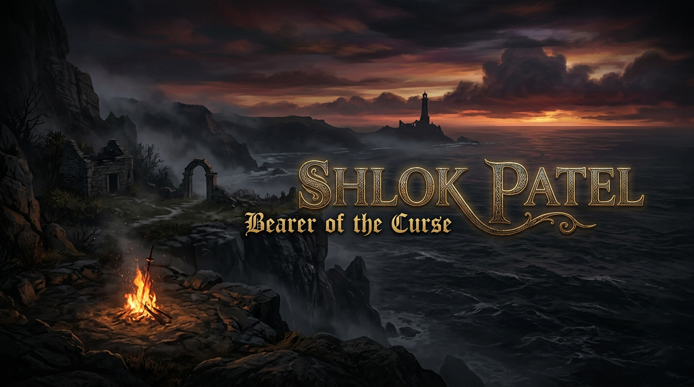
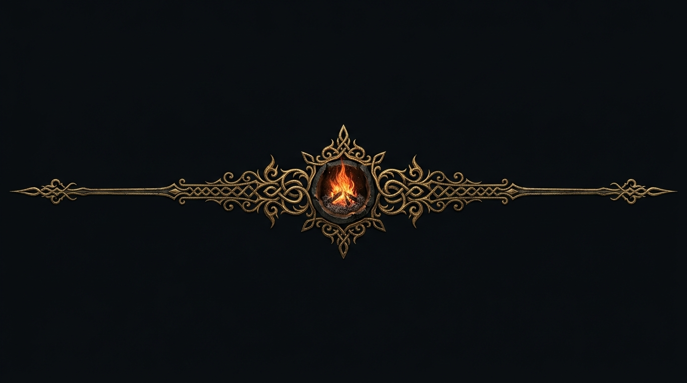
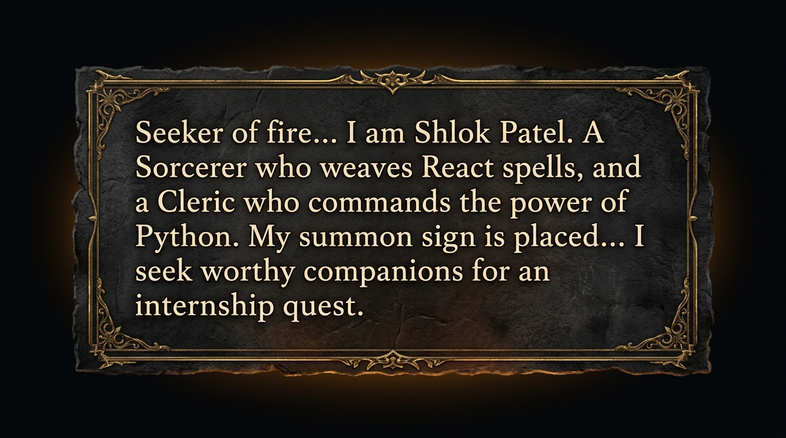

<!--
  ============================================================
   DARK SOULS II THEMED PROFILE  --  Shlok Patel (LAN-SHLOK)
   Commit this file as README.md in a repo named exactly:
   LAN-SHLOK/LAN-SHLOK
  ============================================================
-->

<div align="center">

<!-- ============ 1. TITLE SCREEN ============ -->





<!-- ============ 2. NPC DIALOGUE BOX ============ -->



</div>

<!-- ============ 3. CHARACTER STATUS SCREEN ============ -->

## Character Status

```
 ___________________________________________
|                                           |
|   NAME      : Shlok Patel (LAN-SHLOK)    |
|   CLASS     : Sorcerer / Cleric           |
|   COVENANT  : Heirs of the Sun            |
|   STATUS    : Open to Quests (Internship) |
|___________________________________________|
|                                           |
|   MAIN SPELLS  : Python, Node.js, React   |
|   CURRENT QUEST: Seeking an Internship &  |
|                  Leveling up Tech Stack   |
|___________________________________________|
|                                           |
|   RESTING AT BONFIRE:                     |
|     > Watching Anime & Sitcoms            |
|     > Listening to Music                  |
|     > Beyblade                            |
|     > Pokemon Master in training          |
|___________________________________________|
```

<div align="center">


</div>

<!-- ============ 4. INVENTORY / EQUIPMENT SCREEN ============ -->

## Equipment & Attunement Slots

<div align="center">

### Right Hand (Primary Weapons)

<a href="https://skillicons.dev">
  
</a>

### Left Hand (Catalysts & Staves)

<a href="https://skillicons.dev">
  
</a>

### Armor Set (Frontend)

<a href="https://skillicons.dev">
  
</a>

### Rings (Backend & Languages)

<a href="https://skillicons.dev">
  
</a>

### Estus Flask (Databases & Infra)

<a href="https://skillicons.dev">
  
</a>

### Dark Pyromancy (Generative AI)


### Tools & Design

<a href="https://skillicons.dev">
  
</a>


</div>

<!-- ============ 5. BOSS SOULS (PROJECTS) ============ -->

## Boss Souls Acquired (Featured Projects)

<div align="center">

| Boss Soul | Lore | Elements |
|-----------|------|----------|
| **[Aether-IDE](https://github.com/LAN-SHLOK)** | AI-powered IDE with intelligent coding agents | Python, AI Agents, React |
| **[MediBot](https://github.com/LAN-SHLOK)** | Multi-modal medical AI assistant | FastAPI, Gemini API, RAG |
| **[Gurukul Classes](https://github.com/LAN-SHLOK)** | Full-stack education web platform | React, Node.js, MongoDB |
| **[NeonPulse](https://github.com/LAN-SHLOK)** | Java desktop music player with database integration | JavaFX, SQLite, OOP |

</div>

> Explore all **22+ conquered domains** on my [GitHub Profile](https://github.com/LAN-SHLOK)

<div align="center">


</div>

<!-- ============ 6. SOUL MEMORY (GITHUB STATS) ============ -->

## Soul Memory (GitHub Stats)

<div align="center">


<br><br>


</div>

<!-- ============ 7. SUMMON SIGN (CONNECT) ============ -->

## Place Your Summon Sign

<div align="center">

*Praise the Sun! If you seek a companion for your development journey, summon me:*

<br>

[](https://github.com/LAN-SHLOK)
[](https://linkedin.com/in/shlok-patel-dev)
[](mailto:shlokpatel699@gmail.com)

<br><br>

*"Don't give up, skeleton!"*

<br>


</div>
